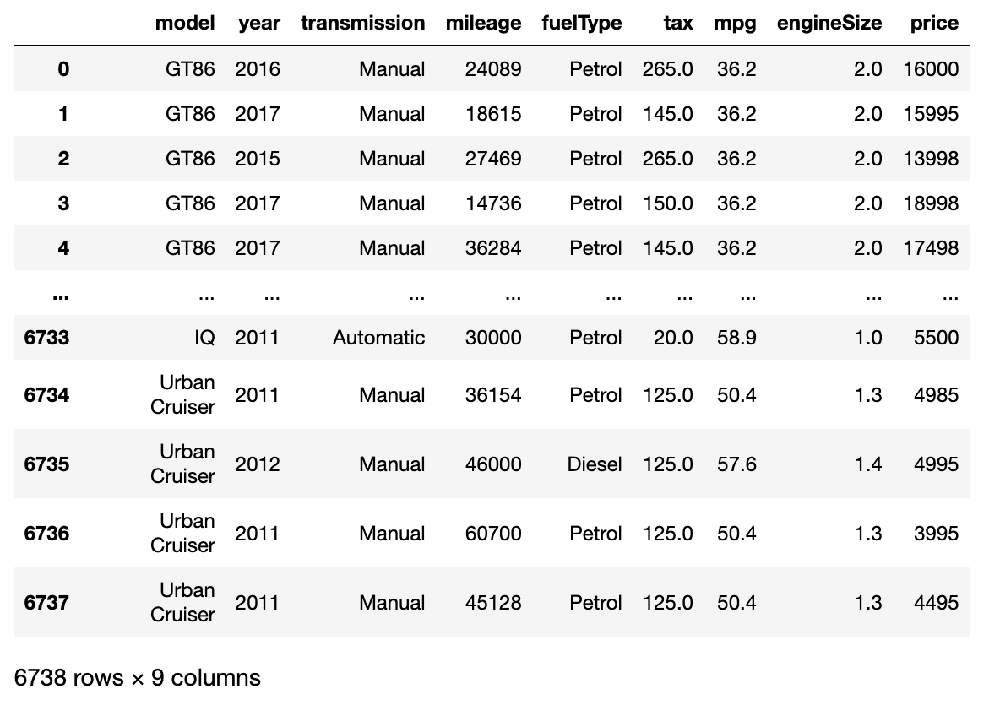
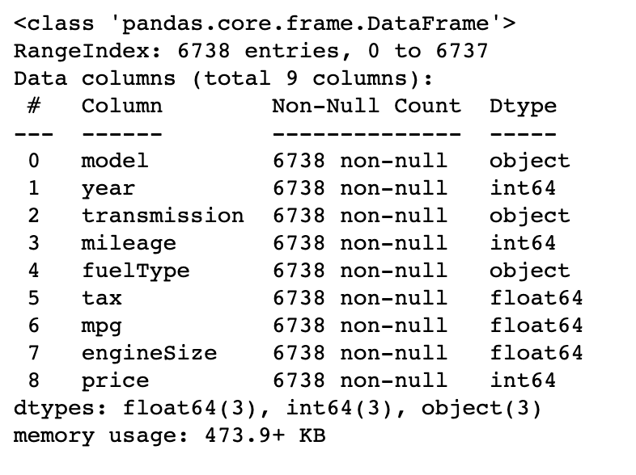
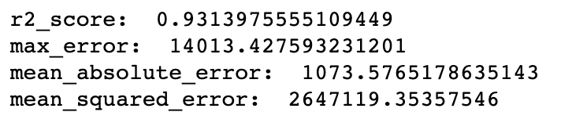
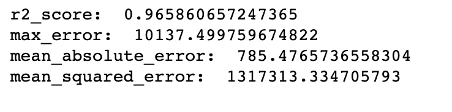
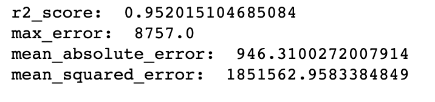
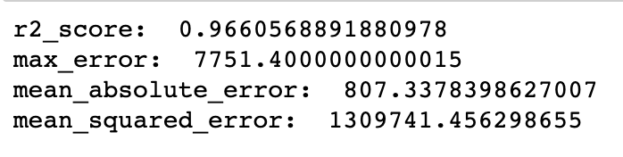

## Introduction

The objective of this project is to train, build, test and select the best regression model to predict the price to sell used Toyota cars, considering their year, transmission, mileage, fuel type, tax, mpg, and engine size. I am using the Heroku platform as a service (PaaS) for the automatic deployment of a machine-learning web app.

I wanted to ease the web app development and [Streamlit](https://www.streamlit.io/) made this possible [1]. It is an open-source library that focuses on data science and ML web app development.

## Selection of Data

The data preprocessing steps are conducted using a Jupyter Notebook and is available [here](https://github.com/vod6atwit/predict_price_used_Toyota/blob/master/preprocessing.ipynb)

All the models training, building, testing, and selecting are conducted using a Jupyter Notebook and is available [here](https://github.com/vod6atwit/predict_price_used_Toyota/blob/master/Models/regression%20models.ipynb)

The data has over 6500 samples with 8 independent/feature variables: model, year, transmission, mileage, fuelType, tax, mpg, and engineSize with 1 dependent variable: Price

The objective is to indicate the price to sell used Toyota cars.

The dataset can found online at [kaggle](https://www.kaggle.com/datasets/aishwaryamuthukumar/cars-dataset-audi-bmw-ford-hyundai-skoda-vw)[2].

#### Data overview:



#### Data info:



Note that data has categorical features in 3 cols: model, transmission, and fuelType.

I used OneHotEncoder/ColumnTransformer on these features and kept the rest of the features as is. When using a Random Forest Regression model, the r2_score always over 95%.

I finally saved the model via joblib to be used for predictions by the web app.

## Methods

### Tools:

- NumPy, SciPy, Pandas, and Scikit-learn for data analysis and inference
- Streamlit (st) for web app design
- GitHub and Heroku for web app deployment and hosting/version control
- VS Code as IDE

### Inference methods used with Scikit:

#### Modules: metrics, compose, preprocessing, model_selection

#### Classes: ColumnTransformer, [OneHotEncoder](https://www.analyticsvidhya.com/blog/2020/03/one-hot-encoding-vs-label-encoding-using-scikit-learn/)[3], StandardScaler, train_test_split, r2_score, max_error, mean_absolute_error, mean_squared_error

#### Multiple Linear Regression model

- y = b0 + b1x1 + b2x2 + ... + bNxN
- [source](https://en.wikipedia.org/wiki/Linear_regression#Simple_and_multiple_linear_regression)[4]
- [source](https://www.simplilearn.com/what-is-backward-elimination-technique-in-machine-learning-article#:~:text=What%20is%20backward%20elimination%20in,is%20removed%20from%20the%20model.)[5]
- [source](https://www.investopedia.com/terms/p/p-value.asp)[6]
- [source](https://www.simplypsychology.org/p-value.html)[7]

#### Support Vector Regression (SVR) model

- [source](https://files.core.ac.uk/pdf/2612/81523322.pdf)[8]
- [source](https://data-flair.training/blogs/svm-kernel-functions/)[9]

#### Decision Tree Regression model

- [source](https://www.section.io/engineering-education/entropy-information-gain-machine-learning/)[10]
- [source](https://towardsdatascience.com/entropy-how-decision-trees-make-decisions-2946b9c18c8)[11]
- [source](https://scikit-learn.org/stable/modules/generated/sklearn.tree.DecisionTreeRegressor.html)[12]

#### Random Forest Regression model

##### Step 1: Pick at random K data points from the Training set.

##### Step 2: Build the Decision Tree associated to these K data points.

##### Step 3: Choose the number Ntree of trees you want to build and repeat STEPS 1 & 2

##### Step 4: For a new data point, make each one of your Ntree trees predict the value of Y for the data point in question, and assign the new data point the average across all of the predicted Y values.

- [source](https://towardsdatascience.com/basic-ensemble-learning-random-forest-adaboost-gradient-boosting-step-by-step-explained-95d49d1e2725)[13]
- [source](https://scikit-learn.org/stable/modules/generated/sklearn.ensemble.RandomForestRegressor.html)[14]

## Results

TODO edit the documentation:

The app is live at https://ds-example.herokuapp.com/
It allows for online and batch processing as designed by the pycaret post:

## Discussion

Experimenting with various models implemented by different regression algorithms and the data was split 80/20 for testing, I found that Random Forest regression with specific number of trees provided one of the highest accuracies. I applied multiple way to [evaluate](https://scikit-learn.org/stable/modules/model_evaluation.html#regression-metrics)[15] the model performance such as r2_score, max_error, mean_absolute_error (MAE), and mean_squared_error (MSE). Across all these evaluations, the results for the random forest regression model were the best of all model

### Multiple Linear Regression results



### Support Vector Regression results



### Decision Tree Regression results



### Random Forest Regression results



Thus, I decided to deploy the Random Forest regression model.

Some of the benefits of Random Forest Regression that I've found underline the acceptable level of success for this dataset

[Why Random Forest is My Favorite Machine Learning Model](https://towardsdatascience.com/why-random-forest-is-my-favorite-machine-learning-model-b97651fa3706)

TODO: edit this line

One unexpected challenge was the free storage capacity offered by Heroku. I experimented with various versions of the libraries listed in `requirements.txt` to achieve a reasonable memory footprint. While I couldn't include the latest pycaret library due to its size, the current setup does include TensorFlow 2.3.1 (even though not utilized by this sample project) to illustrate how much can be done in Heroku's free tier:

```
Warning: Your slug size (326 MB) exceeds our soft limit (300 MB) which may affect boot time.
```

## Summary

This sample project deploys a supervised regression model to predict insurance costs based on 6 features. After experimenting with various feature engineering techniques, the deployed model's testing accuracy hovers around 73%.

The web app is designed using Streamlit, and can do online and batch processing, and is deployed using Heroku and Streamlit. The Heroku app is live at https://ds-example.herokuapp.com/.

Streamlit is starting to offer free hosting as well. The same repo is also deployed at [](https://share.streamlit.io/memoatwit/dsexample/app.py)  
More info about st hosting is [here](https://docs.streamlit.io/en/stable/deploy_streamlit_app.html).

## References

[1] [GitHub Integration (Heroku GitHub Deploys)](https://devcenter.heroku.com/articles/github-integration)

[2] [Streamlit](https://www.streamlit.io/)

[3] [The pycaret post](https://towardsdatascience.com/build-and-deploy-machine-learning-web-app-using-pycaret-and-streamlit-28883a569104)

[4] [Insurance dataset: git](https://github.com/stedy/Machine-Learning-with-R-datasets)

[5] [Insurance dataset: kaggle](https://www.kaggle.com/mirichoi0218/insurance)
